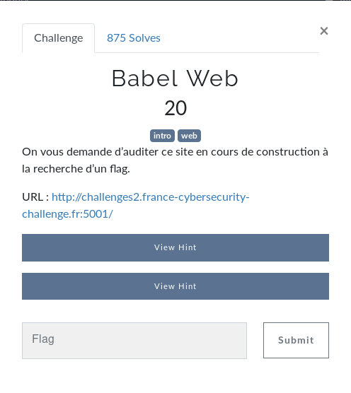
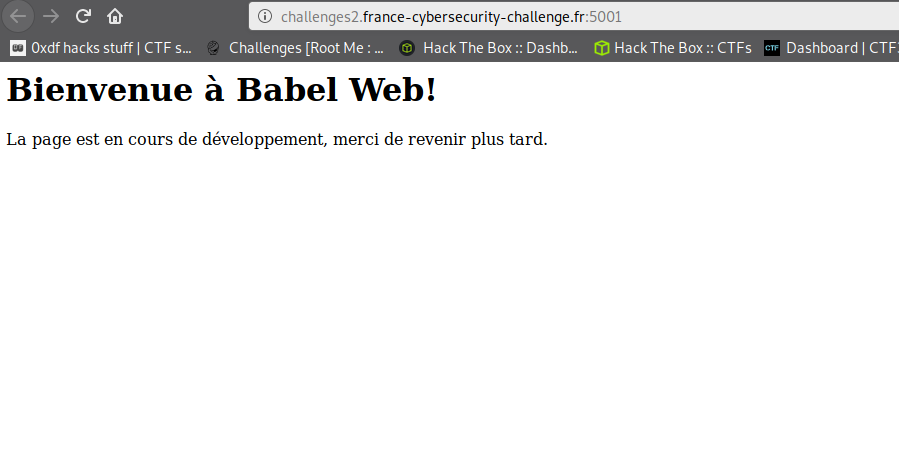
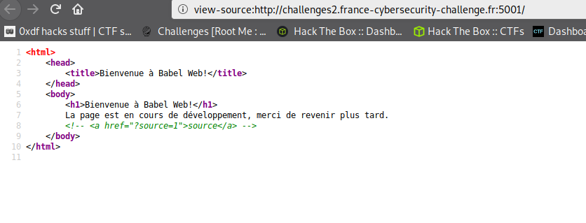
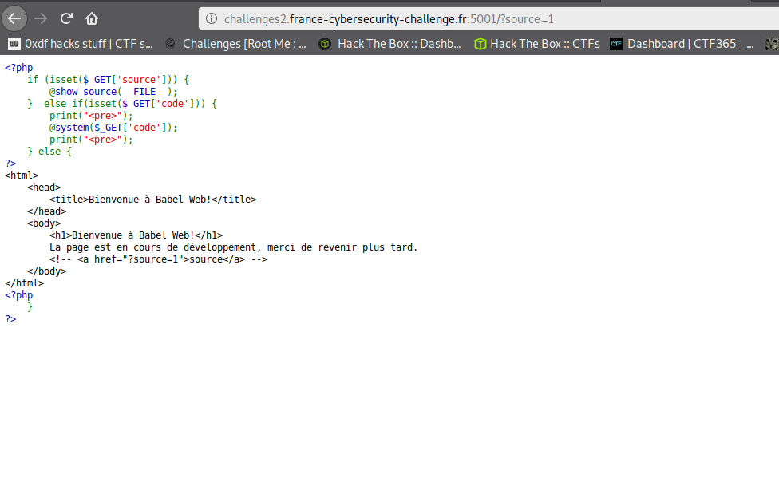
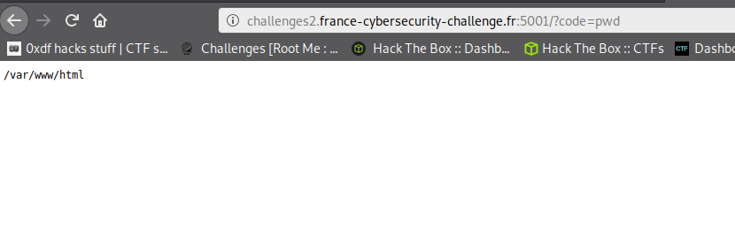
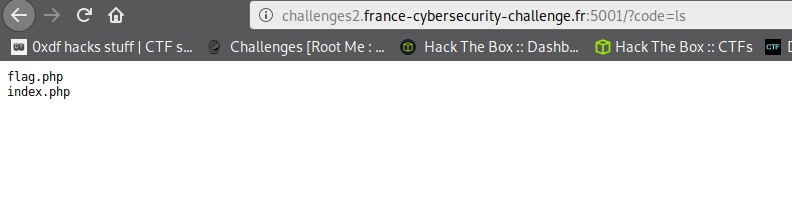
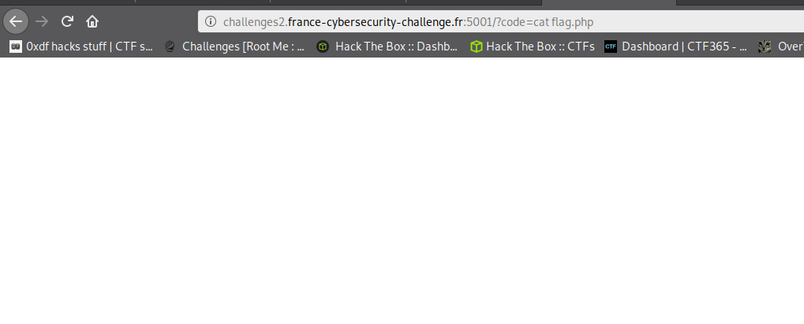
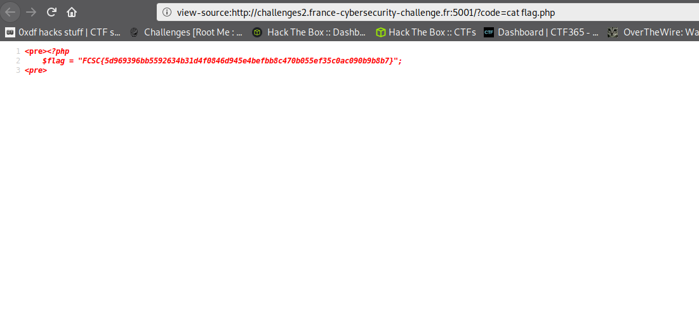

# Babel Web

o/ Ce billet a pour but de présenter le challenge Babel Web du [FCSC 2020](https://www.france-cybersecurity-challenge.fr/)



## Au commencement

Pour ce challenge, on a un site web à auditer pour trouver le flag donc. On va regarder à quoi il ressemble



On a rien de ouf ouf ici. On va regarder le code source de la page



On remarque un bout de code HTML commenté qui indique un paramètre GET `source=1`.

## Afficher le code source tu feras
On va regarder ce que fait cette page



On voit donc le bout de code PHP suivant

```php
<?php
    if (isset($_GET['source'])) {
        @show_source(__FILE__);
    } else if(isset($_GET['code'])) {
        print("<pre>");
        @system($_GET['code']);
        print("</pre>");
    } else {
?>
```

Alors ce qui est intéressant ici c'est `@system($_GET['code']);`. On voit ici qu'on peut potentiellement faire une [LFI (Local File Incluion)](https://en.wikipedia.org/wiki/File_inclusion_vulnerability) sur un paramètre GET `code`. On va tester la commande `pwd` qui devrait nous afficher le chemin du répertoire dans lequel on se situe sur le serveur.

On essaye avec la LFI `?code=pwd`

## Exploitation



On voit ici le chemin du dossier qui s'affiche. L'exploitation fonctionne. On va lister le contenu du dossier avec la LFI `?code=ls`



On voit ici le fichier `flag.php`. On va donc regarder ce qui se trouve à l'intérieur grâce à `?code=cat flag.php`



Hum... Page blanche. On va voir dans le code source de la page



TADAAAAAAAAAAAAA !!

```php
<pre><?php
	$flag = "FCSC{5d969396bb5592634b31d4f0846d945e4befbb8c470b055ef35c0ac090b9b8b7}";
<pre>
```


