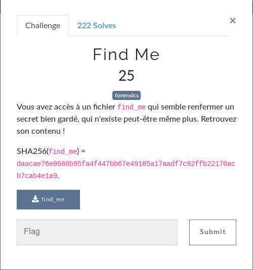

# FindMe

Dans ce billet, on va s'intéresser au challenge FindMe du FCSC 2020




## Petit tour d'horizon

Dans ce challenge, nous avons [ce fichier](ressource/find_me)

Il n'y a pas d'extension. Du coup on va utiliser la commande [`file`](http://man7.org/linux/man-pages/man1/file.1.html) pour savoir quel est le type de ce fichier.

```shell
root@hostname:~# file find_me
find_me: Linux rev 1.0 ext4 filesystem data, UUID=9c0d2dc5-184c-496a-ba8e-477309e521d9, volume name "find_me" (needs journal recovery) (extents) (64bit) (large files) (huge files)
```

On voit ici que c'est un volume (une image disque) ext4.
On va donc le monter.
On commence par créer le répertoire cible.

```shell
root@hostname:~# mkdir findme
```

Et ensuite on monte le volume dans ce dossier.

```shell
root@hostname:~# mount find_me findme
root@hostname:~# cd findme/
root@hostname:~/findme# ls -lah .
total 26M
drwxr-xr-x 3 root root 1,0K avril  1 21:54 .
drwxr-xr-x 4 root root 4,0K mai    4 18:12 ..
drwx------ 2 root root  12K avril  1 21:54 lost+found
-rw-r--r-- 1 root root   32 avril  1 21:54 pass.b64
-rw-r--r-- 1 root root  25M avril  1 22:00 unlock_me
```

On a un dossier et 2 fichiers dans le volume.

/!\ SPOILER ALERT /!\ Dans `lost+found` il n'y a rien ! Nada ! Que dalle !

Si on regarde dans le fichier `pass.b64` on a

```shell
root@hostname:~/findme# cat pass.b64
nothing here. password splited!
```
Circulez ! il n'y a rien à voir.

Notez, quand même, qu'on a une info qui dit que le mot de passe est splité.

Le fichier `unlock_me` a l'air d'être un peu lourd : 25M.
On va bien gentiment demander à `file` quel est le type de ce fichier.

```shell
root@hostname:~/findme# file unlock_me
unlock_me: LUKS encrypted file, ver 1 [aes, xts-plain64, sha256] UUID: 220745be-23df-4ef8-bff0-a36ab5cd1eff
```

On a un volume LUKS chiffré. Il nous faut donc la clé/mot de passe pour le déverouiller.

En relisant le titre du challenge, on a un indice qui dit "qui n'existe peut-être même plus". Cette phrase laisse à penser que le mot de passe a été éffacé.

Bon, comme je suis un bourrin, j'ai fait un `vim find_me` (le fichier volume).
On a un truc qui ressemble à ça dedans


C'est pas joli hein ? Bon on remarque ici des chaînes de caractères `part00`, `part01`, `part02` etc.

Ça pourrait être des fichiers. Le souci c'est que dans notre volume monté, on a aucune trace de ces fichiers.

## Mais où ~~est Charlie~~ sont les fichiers disparus ?

Alors non, je vous ai vu sourire. Il ne sont pas là ;)

Quel est l'outil qu'on utilise pour regarder ce qui a été éffacé ? [`Testdisk`](https://www.cgsecurity.org/wiki/TestDisk_FR) bien sûr !!

On va donc passer un coup de `testdisk` sur le volume find_me .

```shell
root@hostname:~/findme# testdisk ../find_me
```

Et que nous dit `testdisk` ?


On voit ici 21 fichiers effacés. Du coup on va les restaurer.

```shell

root@hostname:~/findme# ls -lah
total 26M
drwxr-xr-x 3 root root 1,0K mai    4 18:15 .
drwxr-xr-x 4 root root 4,0K mai    4 18:12 ..
drwx------ 2 root root  12K avril  1 21:54 lost+found
-r-------- 1 root root    2 avril  1 21:54 part00
-r-------- 1 root root    2 avril  1 21:54 part01
-r-------- 1 root root    2 avril  1 21:54 part02
-r-------- 1 root root    2 avril  1 21:54 part03
-r-------- 1 root root    2 avril  1 21:54 part04
-r-------- 1 root root    2 avril  1 21:54 part05
-r-------- 1 root root    2 avril  1 21:54 part06
-r-------- 1 root root    2 avril  1 21:54 part07
-r-------- 1 root root    2 avril  1 21:54 part08
-r-------- 1 root root    2 avril  1 21:54 part09
-r-------- 1 root root    2 avril  1 21:54 part0a
-r-------- 1 root root    2 avril  1 21:54 part0b
-r-------- 1 root root    2 avril  1 21:54 part0c
-r-------- 1 root root    2 avril  1 21:54 part0d
-r-------- 1 root root    2 avril  1 21:54 part0e
-r-------- 1 root root    2 avril  1 21:54 part0f
-r-------- 1 root root    2 avril  1 21:54 part10
-r-------- 1 root root    2 avril  1 21:54 part11
-r-------- 1 root root    2 avril  1 21:54 part12
-r-------- 1 root root    2 avril  1 21:54 part13
-r-------- 1 root root    1 avril  1 21:54 part14
-rw-r--r-- 1 root root   32 avril  1 21:54 pass.b64
-rw-r--r-- 1 root root  25M avril  1 22:00 unlock_me
```

Si on affiche la concaténation du contenu de ces fichiers `partX` on a

```shell
root@hostname:~/findme# cat part*
TWYtOVkyb01OWm5IWEtzak04cThuUlRUOHgzVWRZ
```

Cette chaîne ressemble à du base64. On va essayer de la décoder.

```shell
root@hostname:~/findme# echo TWYtOVkyb01OWm5IWEtzak04cThuUlRUOHgzVWRZ | base64 -d
Mf-9Y2oMNZnHXKsjM8q8nRTT8x3UdY
```
On essaye de déverouiller le volume ? C'est parti !

```shell
root@hostname:~/findme# cryptsetup luksOpen unlock_me unlocked
Saisissez la phrase secrète pour unlock_me :
root@hostname:~/findme#
```

BINGO !

Coup de bol, j'aurais pu vérifier que la string obtenue par `cat` ne soit pas la clé mais bon, BINGO quand même.

Du coup, regardons ce qu'on a dans ce volume

```shell
root@hostname:~/findme# cd /media/root/畮汯捫敤/
root@hostname:/media/root/畮汯捫敤# ls -lah
total 4,0K
drwxr-xr-x  2 root root   92 avril  1 21:54 .
drwxr-x---+ 3 root root 4,0K mai    4 18:37 ..
-r--------  1 root root   70 avril  1 21:54 .you_found_me
```

On a un fichier caché qui s'appelle `.you_find_me`

Si on affiche son contenu

```shell
root@hostname:/media/root/畮汯捫敤# cat .you_found_me
FCSC{750322d61518672328c856ff72fac0a80220835b9864f60451c771ce6f9aeca1}
```

TADAAAAM !! le sésame.


## Référence

[1] http://man7.org/linux/man-pages/man2/mount.2.html

[2] https://www.cgsecurity.org/wiki/TestDisk_FR

[3] http://man7.org/linux/man-pages/man8/cryptsetup.8.html

