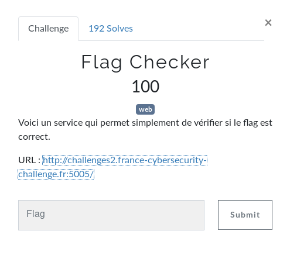
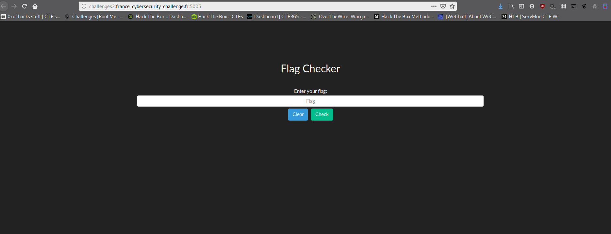
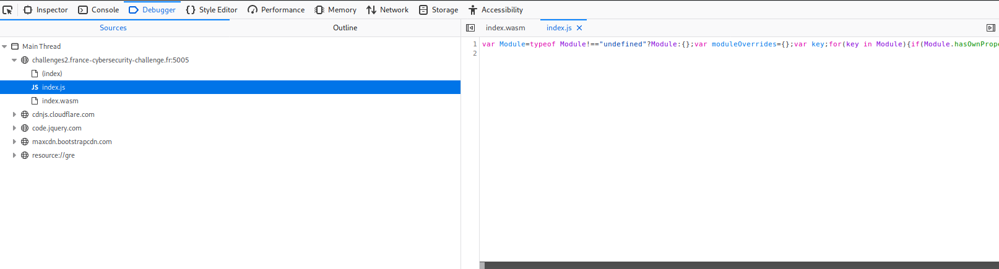
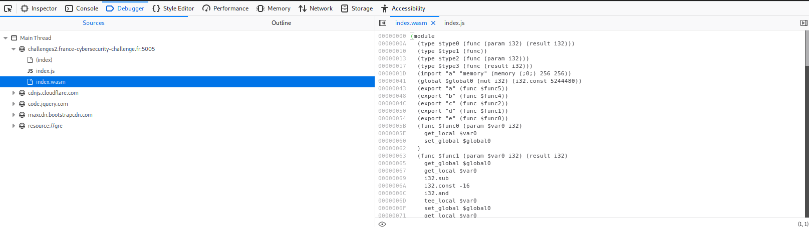
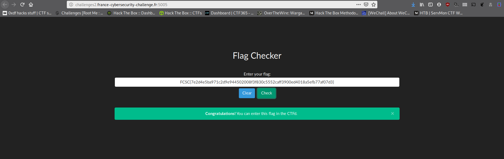
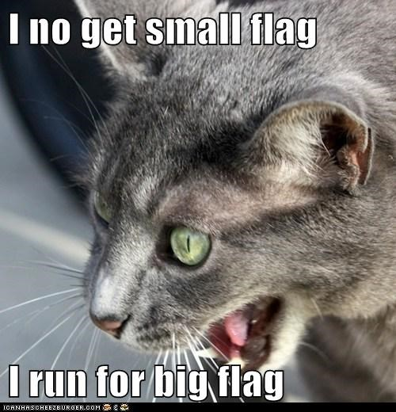

# Flag Checker

Ce billet a pour but de présenter le challenge Flag Checker du [FCSC 2020](https://www.france-cybersecurity-challenge.fr/)



## Repérages

Bon, voyons à quoi ressemble le service



Ok, donc on voit une page avec un Flag à rentrer. S'il est ok, youpi yolo toussa, sinon, on a le droit de recommencer.

On va inspecter un peu le code de la page.



On voit ici 3 fichiers

- Le code source HTML (`index`)
- Un fichier JS ([`index.js`](ressources/index.js))
- Un fichier [WebAssembly](https://fr.wikipedia.org/wiki/WebAssembly) ([`index.wasm`](ressources/index.wasm))

Le code source HTML, rien de pertinent dedans. Le fichier JS utilise des fonctions qui sont défini dans le fihcier WebAssmebly. Regardons un peu le contenu de `index.wasm`



Compliqué à lire. En cherchant un peu sur [Internet](https://fr.wikipedia.org/wiki/Internet), on tombe sur un outil de décompilation de WebAssembly qui se nomme [wasm2c](https://github.com/WebAssembly/wabt/tree/master/wasm2c)

Cet outil va nous permettre de traduire le code WebAssembly en code [C](https://fr.wikipedia.org/wiki/C_(langage))

## Désossons du code !

On va exécuter la commande suivante

```shell
wasm2c index.wasm -o index.c
```

Nous obtenons donc le code C [disponible ici en intégralité](ressources/index.c)

```c

static const u8 data_segment_data_0[] = {
  0x45, 0x40, 0x50, 0x40, 0x78, 0x34, 0x66, 0x31, 0x67, 0x37, 0x66, 0x36,
  0x61, 0x62, 0x3a, 0x34, 0x32, 0x60, 0x31, 0x67, 0x3a, 0x66, 0x3a, 0x37,
  0x37, 0x36, 0x33, 0x31, 0x33, 0x33, 0x3b, 0x65, 0x30, 0x65, 0x3b, 0x30,
  0x33, 0x60, 0x36, 0x36, 0x36, 0x31, 0x60, 0x62, 0x65, 0x65, 0x30, 0x3a,
  0x33, 0x33, 0x66, 0x67, 0x37, 0x33, 0x32, 0x3b, 0x62, 0x36, 0x66, 0x65,
  0x61, 0x34, 0x34, 0x62, 0x65, 0x33, 0x34, 0x67, 0x30, 0x7e,
};
```

Si on décode ce segment, en chaïne de caractère, on obtient la string suivante :

E@P@x4f1g7f6ab:42\`1g:f:7763133;e0e;03\`6661\`bee0:33fg732;b6fea44be34g0~

On se rend vite compte que cette chaïne de caractère est contenue dans le fichier `index.js`
Ceci pourrait être notre flag.

Si on le rentre dans le formulaire du service, ça ne fonctionne pas.

En lisant un peu le code source `index.c`, des opérations sont faites sur une chaïne de caractère d'entrée. Sûrement la chaïne que l'on a envoyé via le frmulaire

```c
static u32 f3(u32 p0) {
  u32 l1 = 0, l2 = 0, l3 = 0, l4 = 0, l5 = 0;
  FUNC_PROLOGUE;
  u32 i0, i1;
  i0 = 70u;
  l3 = i0;
  i0 = 1024u;
  l1 = i0;
  i0 = p0;
  i0 = i32_load8_u(Z_aZ_memory, (u64)(i0));
  l2 = i0;
  i0 = !(i0);
  if (i0) {goto B0;}
  L1:
    i0 = l2;
    i1 = l1;
    i1 = i32_load8_u(Z_aZ_memory, (u64)(i1));
    l4 = i1;
    i0 = i0 != i1;
    if (i0) {goto B2;}
    i0 = l3;
    i1 = 4294967295u;
    i0 += i1;
    l3 = i0;
    i0 = !(i0);
    if (i0) {goto B2;}
    i0 = l4;
    i0 = !(i0);
    if (i0) {goto B2;}
    i0 = l1;
    i1 = 1u;
    i0 += i1;
    l1 = i0;
    i0 = p0;
    i0 = i32_load8_u(Z_aZ_memory, (u64)(i0) + 1u);
    l2 = i0;
    i0 = p0;
    i1 = 1u;
    i0 += i1;
    p0 = i0;
    i0 = l2;
    if (i0) {goto L1;}
    goto B0;
    B2:;
  i0 = l2;
  l5 = i0;
  B0:;
  i0 = l5;
  i1 = 255u;
  i0 &= i1;
  i1 = l1;
  i1 = i32_load8_u(Z_aZ_memory, (u64)(i1));
  i0 -= i1;
  FUNC_EPILOGUE;
  return i0;
}
```

## Devine !

Essayons de décoder le segment trouvé dans le fichier `index.c`. Pour cela, étant donné que les flags sont sous forme `FCSC{xxx}`, où `xxx` est une chaïne de caractère.

Regardons un peu ce qu'il se passe si on applique la fonction [XOR](https://fr.wikipedia.org/wiki/Fonction_OU_exclusif) entre E et F, puis entre @ et C

```php
<?php

$str = "E@P@x4f1g7f6ab:42`1g:f:7763133;e0e;03`6661`bee0:33fg732;b6fea44be34g0~";

echo ord('E' ^ 'F');
echo "\n";
echo ord('@' ^ 'C');
echo "\n";
```

Ce code nous affiche :
```
3
3
```

On a une valeur commune qui nous laisse à penser que si on applique un XOR sur entre l'ensemble des valeurs de la chaïne et 3, nous aurons notre flag.

On construit donc un script qui va essayer de poutrer cette chaïne de caractères.

```php
<?php

echo ord('E' ^ 'F');
echo "\n";
echo ord('@' ^ 'C');
echo "\n";
$output = "";
for ($i=0 ; $i<=strlen($str); $i++) {
    $output .= (substr($str, $i, 1) ^ chr(3));
}

echo $str;
echo "\n";
echo $output;
echo "\n";
```

Ce code nous donne le résultat suivant

```
E@P@x4f1g7f6ab:42`1g:f:7763133;e0e;03`6661`bee0:33fg732;b6fea44be34g0~
FCSC{7e2d4e5ba971c2d9e944502008f3f830c5552caff3900ed4018a5efb77af07d3}

```

On rentre cette string dans le formulaire de la page, et, et, et ?

**Roulement de tambour**...



ET VLAN !! ET PAF !! YOU WIN !!!!


