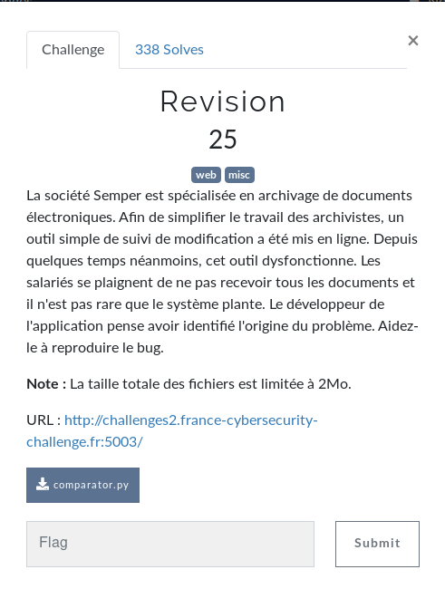
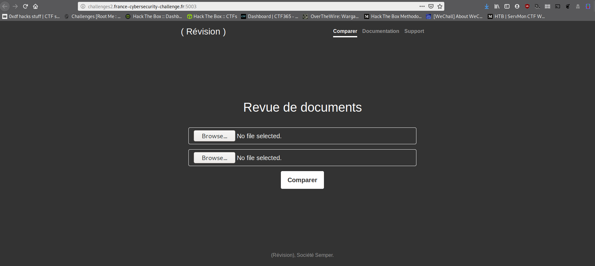
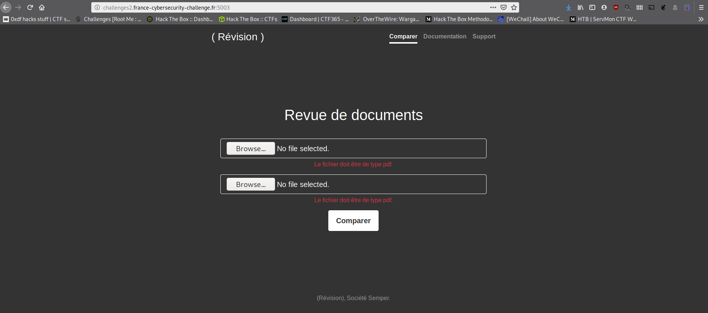
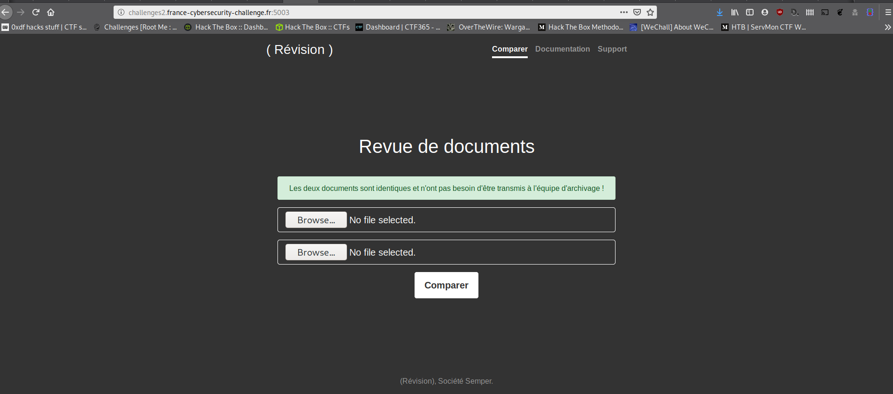
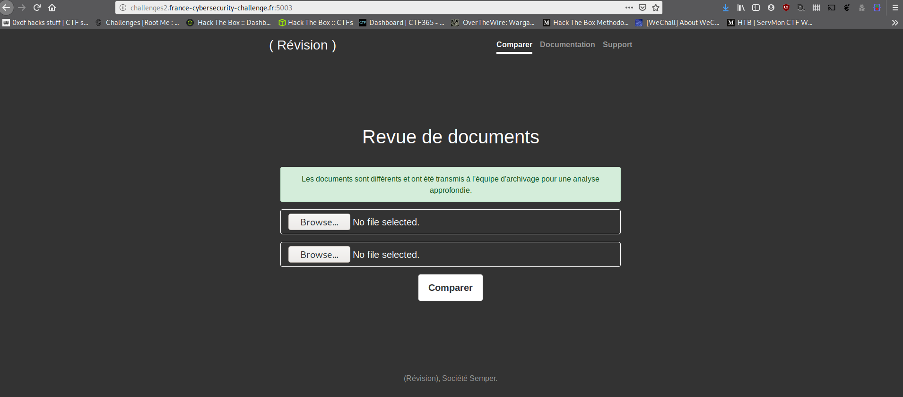
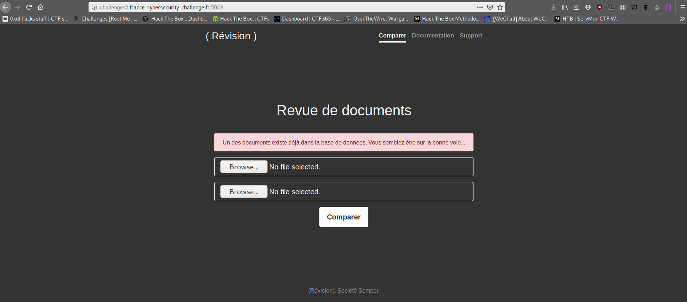
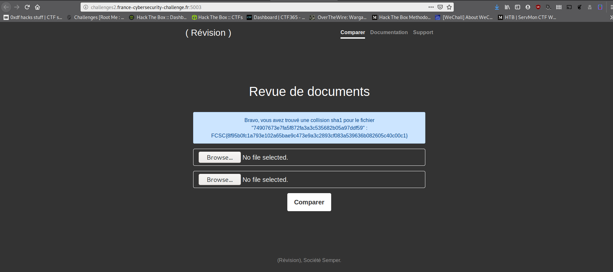

# Revision

Pouet ! Dans cet article, on va regarder le challenge Révision [FCSC 2020](https://www.france-cybersecurity-challenge.fr/)



## Here we go

On a ici un site d'archivage de documents électroniques. On a le code ([disponible ici](ressources/comparator.py)) de la page.

On va déjà regarder comment est fait le site fonctionnellement parlant.



On a ici 2 champs "file". On va lui soumettre 2 images par exemple.



Si on lui soumet 2 fichiers au format PDF (le même)



On a un message qui dit que les documents sont les mêmes et qu'aucune opération ne sera faite.

Si on lui soumet 2 PDFs différents,



Les documents sont envoyés à l'équipe d'archivage.

L'énoncé nous disait que "Depuis quelques temps néanmoins, cet outil dysfonctionne. Les salariés se plaignent de ne pas recevoir tous les documents et il n'est pas rare que le système plante". Et qu'il faut aider le mec qui a développé ce truc à reproduire le bug.

Heureusement, notre cher développeur adoré nous a envoyé le code source.

```python
# coding: utf-8
import hashlib
from web.services.database import Database
from web.services.mailer import Mailer


class ComparatorError(Exception):
    """Base class for all Comparator exceptions"""
    pass


class DatabaseError(ComparatorError):
    """Exception raised for errors in database operations."""


class StoreError(ComparatorError):
    """Exception raised for errors in store function.

    Attributes:
        message -- explanation of the error
    """

    def __init__(self, files, message):
        self.files = files
        self.message = message


class Comparator(object):
    """A class for Comparator"""

    BLOCK_SIZE = 8*1024

    def __init__(self, f1=None, f2=None):
        """
        Set default parameters

        Required parameters :
            f1: open file handler
            f2: open file handler
            db: database
            m : mailer

        """
        self.f1 = f1
        self.f2 = f2
        self.db = Database()
        self.m = Mailer()

    def compare(self):
        self._reset_cursor()
        return self.f1.read() == self.f2.read()

    def store(self):
        self._reset_cursor()
        f1_hash = self._compute_sha1(self.f1)
        f2_hash = self._compute_sha1(self.f2)

        if self.db.document_exists(f1_hash) or self.db.document_exists(f2_hash):
            raise DatabaseError()

        attachments = set([f1_hash, f2_hash])
        # Debug debug...
        if len(attachments) < 2:
            raise StoreError([f1_hash, f2_hash], self._get_flag())
        else:
            self.m.send(attachments=attachments)

    def _compute_sha1(self, f):
        h = hashlib.sha1()
        buf = f.read(self.BLOCK_SIZE)
        while len(buf) > 0:
            h.update(buf)
            buf = f.read(self.BLOCK_SIZE)
        return h.hexdigest()

    def _reset_cursor(self):
        self.f1.seek(0)
        self.f2.seek(0)

    def _get_flag(self):
        with open('flag.txt', 'r') as f:
            flag = f.read()
        return flag
```

Pour une fois on n'a pas affaire à du [PHP](https://fr.wikipedia.org/wiki/PHP) mais à du [Python](https://fr.wikipedia.org/wiki/Python_(langage)).

Que nous dit ce code ?

## Analyse du ~~boa~~ Python

On voit 3 classes qui correspondent à des classes d'exceptions.

Puis on a la classe `Comparator`.

Intéressons-nous à cette méthode

```python
def store(self):
    self._reset_cursor()
    f1_hash = self._compute_sha1(self.f1)
    f2_hash = self._compute_sha1(self.f2)

    if self.db.document_exists(f1_hash) or self.db.document_exists(f2_hash):
        raise DatabaseError()

    attachments = set([f1_hash, f2_hash])
    # Debug debug...
    if len(attachments) < 2:
        raise StoreError([f1_hash, f2_hash], self._get_flag())
    else:
        self.m.send(attachments=attachments)
```

On récupère le condensat [SHA1](https://fr.wikipedia.org/wiki/SHA-1) de `f1` et `f2` (des fichiers 1 et fichiers 2 donc). Dans la condition d'après, si le condensat de `f1` ou que le condensat de `f2` est présent en base de données, alors on balance une exception `DatabaseError` définie un peu plus haut dans ce fichier.

Ensuite l'instruction suivante est intéressante

```python
attachments = set([f1_hash, f2_hash])
```

Cette instruction récupère un tableau de condensat SHA1 des 2 fichiers envoyés.

La fonction [set](https://docs.python.org/3/library/stdtypes.html#set) de Python est l'équivalent du [array_unique](https://www.php.net/manual/fr/function.array-unique.php) de PHP, même si c'est pas tout à fait ça. En tout cas, ici nous allons le [considérer en tant que tel](https://www.youtube.com/watch?v=Tj_DHw6L9BQ). Si la valeur est la même, un tableau avec des valeurs dédoublonnées sera retourné. En l'occurrence, ici, nous aurions un tableau avec... une seule valeur !

Puis, si la longueur du tableau est inférieure à 2, alors YOLO on fait la fête tout nu dans la forêt toussa... sinon, on envoie les documents au service concerné.

## Du coup, keskonfé ?

Du coup, le cas qui nous intéresse, c'est le cas où ~~on va faire la fête tout nu dans la forêt~~ on n'a qu'un seul élément dans notre tableau.

Qu'est-ce que cela implique ? Tout simplement qu'il nous faut 2 fichiers différents, mais avec le même condensat. On va donc s'intéresser à comment générer une [collision](https://fr.wikipedia.org/wiki/Attaque_de_collisions) SHA1 !

## Les collisions

En cherchant un peu sur [Internet](https://fr.wikipedia.org/wiki/Internet), on tombe sur le site [Shattered.io](http://shattered.io/). [Shattered](https://en.wikipedia.org/wiki/SHA-1#SHAttered_%E2%80%93_first_public_collision) est une attaque par collision, dévoilée le 23 Fevrier 2017 par [Google](https://fr.wikipedia.org/wiki/Google) et [CWI](https://en.wikipedia.org/wiki/Centrum_Wiskunde_%26_Informatica) permettant de générer 2 fichiers PDF différents avec le même hash SHA1.

En allant sur le [site](http://shattered.io/) qui présente l'attaque, on peut se procurer les 2 PDFs en question.

On va essayer de l'envoyer à notre plateforme.



On a un beau message d'erreur qui nous dit "Bravo coco, t'as trouvé le pourquoi du comment mais c'est trop facile donc débrouille toi pour m'en filer 2 autres".

Bon, quand on cherche un peu, on tombe sur ce [github](https://fr.wikipedia.org/wiki/GitHub) intéressant : [sha1collider](https://github.com/nneonneo/sha1collider).

Ce programme nous permet de tenter de générer 2 fichiers PDFs en sortie ayant le même hash SHA1 et avec 2 PDFs différents en entrée.

## Génération ~~(disco !!!!)~~

Pour générer notre collision on va

- Créer un premier fichier texte, qu'on va appeler [`text1.txt`](ressources/text1.txt) qui va contenir : "test1"
- Créer un deuxième fichier texte, qu'on va appeler [`text2.txt`](ressources/text2.txt) qui va contenir : "test2"
- On va convertir ces 2 fichiers texte en PDF

```shell
convert text1.txt text1.pdf
convert text2.txt text2.pdf
```

- Maintenant qu'on a nos fichiers [`text1.pdf`](ressources/text1.pdf)(qui a le hash SHA1 84132eda0cd60ba6223ae1946cb11c8e7c0568ca) et [`text2.pdf`](ressources/text2.pdf)(qui a le hash SHA1 f8a12aec62f6a0fa41639949610fe3a2a8532f5f), on va lancer la commande

```shell
python3 collide.py --progressive test1.pdf test2.pdf
```

Et PAF ! Quelques secondes après, on a 2 fichiers [`out-text1.pdf`](ressources/out-text1.pdf) et [`out-text2.pdf`](assets/out-text2.pdf) qui ont nos 2 contenus initialement différents et exactement le même hash SHA1 !

On va les envoyer à la plateforme



\>o\_ ET PAN ! _/o<

```
Bravo, vous avez trouvé une collision sha1 pour le fichier "74907673e7fa5f872fa3a3c535682b05a97ddf59" :
FCSC{8f95b0fc1a793e102a65bae9c473e9a3c2893cf083a539636b082605c40c00c1}
```


